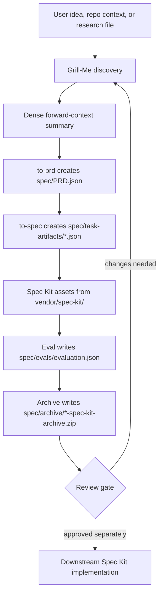

# Grill to Spec

Grill to Spec is a Codex plugin that turns rough product research into a
phase-gated spec workflow:

1. Grill the user one question at a time.
2. Generate a machine-actionable `PRD.json`.
3. Decompose the PRD into traceable task artifacts with tasks.
4. Use vendored Spec Kit scripts, command templates, and workflow metadata.
5. Evaluate the generated outputs with a repeatable rubric.
6. Save the evaluated handoff as a Spec-Kit archive that includes `grill-me`.

The generated artifacts from the included product research live under
`spec/`.

The workflow intentionally stops at the planning handoff. It does not auto-start
Spec Kit implementation, edit product code, or mark generated tasks complete
unless the user separately approves implementation after reviewing the artifacts.

## How It Works



The diagram shows the intended boundary: Grill to Spec owns discovery,
planning artifacts, evaluation, and archive creation. Implementation is a
separate downstream action and requires explicit approval after the user reviews
the generated PRD, task artifacts, and eval report.

| Phase | Primary input | Output |
| --- | --- | --- |
| Grill | User answers, repo context, or research notes | Resolved scope, constraints, edge cases, and quality gates |
| Forward context | Resolved grill decisions | Dense handoff summary for PRD generation |
| PRD | Handoff summary or source markdown | `spec/PRD.json` |
| Tasks | `spec/PRD.json` | `spec/task-artifacts/index.json` and task artifact JSON files |
| Spec Kit handoff | Task artifacts plus `vendor/spec-kit/` | Local command-template and script handoff assets |
| Eval | PRD, task artifacts, and bundled Spec Kit assets | `spec/evals/evaluation.json` |
| Archive | Evaluated artifacts and plugin assets | `spec/archive/*-spec-kit-archive.zip` plus manifest |

## What Is Included

- `.codex-plugin/plugin.json` - Codex plugin manifest.
- `.agents/plugins/marketplace.json` - Codex marketplace descriptor that
  points at the cacheable plugin package.
- `plugins/grill-to-spec/` - installable plugin package used by Codex's plugin
  cache.
- `skills/` - bundled Codex skills:
  - `grill-to-spec`
  - `grill-me`
  - `to-prd`
  - `to-spec`
  - `evaluate-spec-output`
- `scripts/grill_to_spec.py` - deterministic local generator, validator, and
  evaluator.
- `schemas/` - JSON schema references for PRD and task artifacts.
- `evals/rubric.json` - scoring rubric.
- `vendor/spec-kit/` - vendored Spec Kit scripts, command templates, and
  workflow metadata copied from the upstream GitHub Spec Kit project.
- `tests/test_grill_to_spec.py` - regression tests for PRD, task artifact, and eval
  output.
- `spec/archive/` - generated Spec-Kit archives and archive manifests.

## Install From Main Branch

After this repository is published at:

```text
https://github.com/mutexdev/grill-to-spec
```

add it to Codex with the plugin marketplace command:

```bash
codex plugin marketplace add mutexdev/grill-to-spec --ref main
```

This command expects a marketplace descriptor at
`.agents/plugins/marketplace.json`; this repository includes one and maps the
marketplace entry to `plugins/grill-to-spec/`, the package layout Codex copies
into its plugin cache. Users do not need to clone this repository manually or
edit local marketplace config by hand.

For a local checkout sanity check, run:

```bash
codex plugin marketplace add /absolute/path/to/grill-to-spec
```

Restart Codex, open `/plugins`, and install or enable **Grill to Spec** from
the marketplace entry. Then start Codex in a workspace and use one of the
plugin starter prompts:

```text
Run grill-to-spec for this feature.
Create PRD.json, task artifacts, and evals.
Create a Spec-Kit archive with the eval report.
```

If you only want one bundled skill instead of the full plugin, install a skill
from the `main` branch with Codex's skill installer:

```bash
python3 ~/.codex/skills/.system/skill-installer/scripts/install-skill-from-github.py \
  --repo mutexdev/grill-to-spec \
  --ref main \
  --path skills/grill-to-spec
```

## Remove the Plugin

To stop using the plugin, open `/plugins` in Codex and disable or uninstall
**Grill to Spec**. Restart Codex after removing it so the active skill list is
refreshed.

If you also added this repository as a plugin marketplace source, remove that
marketplace entry with the same name you used when adding it:

```bash
codex plugin marketplace remove mutexdev/grill-to-spec
```

For a local checkout marketplace entry, replace `mutexdev/grill-to-spec` with
the configured local marketplace name shown by Codex.

If you installed only a standalone skill with the skill installer, remove that
skill from `~/.codex/skills/` and restart Codex.

## Local Usage

Generate artifacts from the included research file:

```bash
python3 -B scripts/grill_to_spec.py generate \
  --source grill-to-spec.md \
  --output spec \
  --project-name grill-to-spec
```

Refresh the full local handoff after changing docs, skills, schemas, or vendored
assets:

```bash
python3 -B scripts/grill_to_spec.py generate --source grill-to-spec.md --output spec --project-name grill-to-spec
python3 -B scripts/grill_to_spec.py validate --output spec
python3 -B scripts/grill_to_spec.py eval --output spec
python3 -B scripts/grill_to_spec.py archive --output spec
python3 -B -m unittest tests/test_grill_to_spec.py
```

Validate generated artifacts:

```bash
python3 -B scripts/grill_to_spec.py validate --output spec
```

Re-run the eval report:

```bash
python3 -B scripts/grill_to_spec.py eval --output spec
```

Create the shareable Spec-Kit archive:

```bash
python3 -B scripts/grill_to_spec.py archive --output spec
```

This refreshes `spec/evals/evaluation.json`, validates the artifacts, and writes
`spec/archive/<project>-spec-kit-archive.zip` plus a JSON manifest. The archive
contains the PRD, task artifacts, eval report, `grill-me` skill, plugin
manifest, and vendored Spec Kit assets.

Run tests:

```bash
python3 -B -m unittest tests/test_grill_to_spec.py
```

## Spec Kit Assets

This plugin does not register or start a server. Spec Kit integration is local:

- `vendor/spec-kit/scripts/bash/*.sh`
- `vendor/spec-kit/scripts/powershell/*.ps1`
- `vendor/spec-kit/templates/commands/*.md`
- `vendor/spec-kit/workflows/speckit/workflow.yml`

The `grill-to-spec` skill uses the local PRD/task artifacts as the source of
truth, then packages those artifacts together with the vendored Spec Kit assets.

## Verification Status

Current local verification:

```text
python3 -B -m unittest tests/test_grill_to_spec.py
python3 -B scripts/grill_to_spec.py validate --output spec
python3 -B -m json.tool .codex-plugin/plugin.json
python3 -B scripts/grill_to_spec.py archive --output spec
```

The generated eval report is written to `spec/evals/evaluation.json`.
