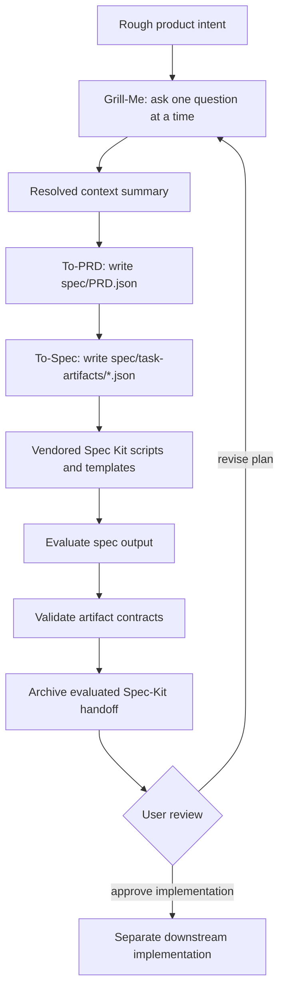

# Grill to Spec Local Spec Kit Integration

Grill to Spec is a Codex plugin for turning rough product intent into a
phase-gated, spec-driven handoff. The workflow is local and artifact-first:

1. Grill the user one question at a time until scope, edge cases, dependencies,
   quality gates, and testing expectations are explicit.
2. Convert the resolved context into `spec/PRD.json` with stable IDs for user
   stories, requirements, acceptance criteria, implementation decisions, testing
   decisions, and traceability.
3. Decompose the PRD into `spec/task-artifacts/*.json` with vertical-slice tasks,
   blockers, HITL/AFK classification, acceptance criteria, verification commands,
   and PRD references.
4. Use vendored Spec Kit assets from `vendor/spec-kit/` for command templates,
   setup scripts, and workflow metadata.
5. Evaluate artifact quality and archive the handoff for review or downstream
   execution.

## Workflow Diagram

The workflow is intentionally artifact-first. Each phase consumes the previous
phase's reviewed output, and the archive is the shareable boundary between
planning and any later implementation work.

## Phase Contract

- Grill resolves scope, edge cases, dependencies, testing expectations, and
  quality gates before any artifact is generated.
- PRD generation creates stable IDs for stories, requirements, acceptance
  criteria, implementation decisions, testing decisions, and traceability.
- Task decomposition creates vertical-slice task artifacts with blockers,
  HITL/AFK classification, verification commands, and PRD references.
- Spec Kit integration uses local files from `vendor/spec-kit/`; no server or
  runtime download is required for the handoff.
- Evaluation and validation produce an auditable quality signal before archive
  creation.
- Implementation is outside this workflow until the user reviews the archive and
  explicitly approves downstream execution.

## Design Constraints

- Do not start a network server for Spec Kit behavior.
- Do not require a runtime package download to create the spec handoff.
- Keep the generated PRD, task artifacts, eval report, and archive deterministic
  enough to validate in tests.
- Keep the installable plugin package self-contained by mirroring runtime
  scripts, schemas, eval rubrics, skills, and vendored Spec Kit assets under
  `plugins/grill-to-spec/`.
- Do not write implementation code until PRD generation, task decomposition,
  evaluation, validation, and an explicit post-review user approval have passed.
- Do not auto-send a Spec Kit implementation handoff from the tasks phase; the
  intended end result is a PRD plus spec/task artifacts ready for review.

## Bundled Spec Kit Assets

The plugin vendors these upstream GitHub Spec Kit paths:

- `vendor/spec-kit/scripts/bash/`
- `vendor/spec-kit/scripts/powershell/`
- `vendor/spec-kit/templates/`
- `vendor/spec-kit/workflows/speckit/`

Agents should use those local assets together with the generated `spec/` files.
The local JSON artifacts remain the source of truth for traceability.

## Acceptance Criteria

- Given the plugin manifest, when Codex loads the plugin, then no server entry is
  registered or launched.
- Given a marketplace install, when Codex copies `plugins/grill-to-spec/`, then
  the package includes skills, runtime scripts, schemas, eval rubric, and
  vendored Spec Kit assets.
- Given product research, when `scripts/grill_to_spec.py generate` runs, then it
  writes `PRD.json`, task artifacts, and an eval report.
- Given generated artifacts, when archive creation runs, then the archive
  contains the PRD, task artifacts, eval report, plugin manifest, grill-me skill,
  and vendored Spec Kit assets.
